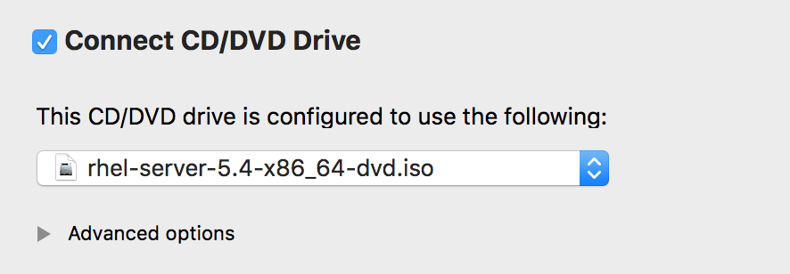

This is a continuation chapter. You need to complete the [last chapter](https://jiadreamran.github.io/my_blog/hadoop/2017/09/24/spark-installation-from-scratch.html){:target="_blank"} before proceeding.

# Scala Installation

## Download Scala
Spark is writtin in Scala programming language, so you need to install it first. In this learning notebook, I chose Scala 2.10.5 so I can work with my previously selected hadoop version. Download the installation tar file [here](https://downloads.lightbend.com/scala/2.10.5/scala-2.10.5.tgz){:target="_blank"}.

## Install Scala
SSH into "master" and "slave01", using hadoop user. You can use your pre-configured Shuttle to do so.

Use FileZilla to transfer the downloaded installation package into both vms' "installer" folder.

Extract Scala package for both vms. Rename the extracted folder to "scala".

```bash
cd installer
tar -zxvf scala-2.10.5.tgz
mv scala-2.10.5 scala
```

## Configure Scala
Modify .bashrc file to this and make the change effective immediately.

```bash
# .bashrc

# Source global definitions
if [ -f /etc/bashrc ]; then
        . /etc/bashrc
fi

# User specific aliases and functions
export JAVA_HOME=/usr/java/jdk1.7.0_80
export SCALA_HOME=/home/hadoop/installer/scala
export HADOOP_HOME=/home/hadoop/installer/hadoop2
export HADOOP_COMMON_LIB_NATIVE_DIR=${HADOOP_HOME}/lib/native
export HADOOP_OPTS="-Djava.library.path=$HADOOP_HOME/lib"
# Append Java lib, Hadoop lib, Scala lib to CLASSPATH
export CLASSPATH=$CLASSPATH:$JAVA_HOME/lib:$HADOOP_HOME/lib:$SCALA_HOME/lib
# Append Java bin, Hadoop bin/sbin, Scala bin to PATH
export PATH=$PATH:$JAVA_HOME/bin:$HADOOP_HOME/bin:$HADOOP_HOME/sbin:$SCALA_HOME/bin
```

SCP the configured .bashrc file to "slave01".

```bash
scp .bashrc slave01:~
```

Also make it effective on "slave01".

Go back to "master", you should be able to run:

```bash
scala

# To quit scala mode:
:q
```

If you see the following output after you invoke Scala, you have successfully installed and configured Scala:

```bash
Welcome to Scala version 2.10.5 (Java HotSpot(TM) 64-Bit Server VM, Java 1.7.0_80).
Type in expressions to have them evaluated.
Type :help for more information.

scala> 
```

# Intall Python

I like Python better than Scala so I will install it :)

A few steps to install Python:

1. Install gcc
2. Install Python
3. Install zlib

## Install GCC

To install gcc, you need to use "root" user for both vms.

This is a very import (and yet annoyingly difficult to get) part: you need to enable CD/DVD of your vms. By default, you already have the necessary ISO file, so you just need to go to VM Fushion, select your "master" machine, and go to "Setttings" > "CD/DVD (SATA)" > "Connect to CD".



What you need to do:
1. Create a folder "/RHEL5U4" to copy your media to. This folder will hold all the RPMs that will later be used for yum install.
2. Mount the CDROM to a folder.
3. Copy the CD content to "/RHEL5U4" folder.
4. Do a yum install on GCC.
Now you have the CD/DVD ROM connected, you can mount the CDROM to "/media".

Step 1 to 3:

```bash
mkdir /RHEL5U4
mount /dev/cdrom /media/
cd /media/
cp -r * /RHEL5U4/
```

There is no configurations for your yum install, you need to create and config it:

```bash
vim /etc/yum.repos.d/iso.repo
```

Config file content:

```bash
[rhel-Server]
Name=5u4_Server
Baseurl=file:///RHEL5U4/Server
Enable=1
Gpgcheck=0
Gpgkey=file:///etc/pki/rpm-gpg/RPM-GPG-KEY-redhat-release
```

Now install gcc:

```bash
yum clean all
yum install gcc
```

## Install Python

[Download Python 2.7.12 souce code](https://www.python.org/ftp/python/2.7.12/Python-2.7.12.tgz){:target="_blank"}. Here is also the download page for reference:
[https://www.python.org/downloads/release/python-2712/](https://www.python.org/downloads/release/python-2712/){:target="_blank"}.

FTP the tgz file to both vms, under root user's installer directory. Unzip Python.

```bash
cd installer
tar -zxvf Python-2.7.12.tgz
```

## Install zlib

[Download zlib 1.2.8](https://sourceforge.net/projects/libpng/files/zlib/1.2.8/zlib-1.2.8.tar.gz/download?use_mirror=phoenixnap&download=){:target="_blank"}.

Upload the gzip file to installer folder (root user) for both vms. Unzip it. Then rename the zipped folder to "zlib". Lastly, replace the zlib folder in Python module folder with this zlib folder (both vms).

```bash
# In installer folder
tar -zxvf zlib-1.2.8.tar.gz
mv zlib-1.2.8 zlib
rm -rf Python-2.7.12/Modules/zlib/
mv zlib Python-2.7.12/Modules/
```

Install Python, do it for both vms:

```bash
cd Python-2.7.12
./configure --prefix=/usr/local/python27
make
make install 
# Rename the old Python folder (comes with Redhat)
mv /usr/bin/python /usr/bin/python_old
# Replace with newly Installed Python
ln -s /usr/local/python27/bin/python /usr/bin/
python
```

# Install Spark

## Spark Download
[Download Spark 2.0.0 for Hadoop 2.6 Version](https://d3kbcqa49mib13.cloudfront.net/spark-2.0.0-bin-hadoop2.6.tgz){:target="_blank"}. Here is also the download page for reference:
[https://spark.apache.org/downloads.html](https://spark.apache.org/downloads.html){:target="_blank"}.

FTP the tar file to hadoop@master's installer folder. Unzip it:

## Spark Extraction/Installation

```bash
# "hadoop" is the user, "master" is the machine
cd installer
tar -zxvf spark-2.0.0-bin-hadoop2.6.tgz
# Rename the extracted folder
mv spark-2.0.0-bin-hadoop2.6 spark2
```

## Spark Environment Variable Configuration

Go back to hadoop user's root directory in "master", then open environment config file. Replace the config file with following.

```bash
# .bashrc

# Source global definitions
if [ -f /etc/bashrc ]; then
        . /etc/bashrc
fi

# User specific aliases and functions
export JAVA_HOME=/usr/java/jdk1.7.0_80
export SCALA_HOME=/home/hadoop/installer/scala
export SPARK_HOME=/home/hadoop/installer/spark2
export HADOOP_HOME=/home/hadoop/installer/hadoop2
export HADOOP_COMMON_LIB_NATIVE_DIR=${HADOOP_HOME}/lib/native
export HADOOP_OPTS="-Djava.library.path=$HADOOP_HOME/lib"
# Append Java lib, Hadoop lib, Scala lib to CLASSPATH
export CLASSPATH=$CLASSPATH:$JAVA_HOME/lib:$HADOOP_HOME/lib:$SCALA_HOME/lib:$SPARK_HOME/jars
# Append Java bin, Hadoop bin/sbin, Scala bin to PATH
export PATH=$PATH:$JAVA_HOME/bin:$HADOOP_HOME/bin:$HADOOP_HOME/sbin:$SCALA_HOME/bin:$SPARK_HOME/bin:$SPARK_HOME/sbin
```

Make the .bashrc file effective.

SCP the .bashrc file to "slave01", make it effective there.

```bash
scp .bashrc slave01:~
```

## Spark Application Configuration

Create and configure spark-env shell script:

```bash
cp spark-env.sh.template spark-env.sh
vim spark-env.sh
```

Add the following to spark-evn.sh file, it should be literally empty, just have all types of comments:

```bash
export JAVA_HOME=/usr/java/jdk1.7.0_80
export SCALA_HOME=/home/hadoop/installer/scala
export SPARK_MASTER_HOST=master
export HADOOP_CONF_DIR=$HADOOP_HOME/etc/hadoop
export SPARK_EXECUTOR_MEMORY=600M
export SPARK_DRIVER_MEMORY=600M
```

Configure "slave" file:

```bash
vim slave
```

Type in the following entries:

```bash
master
slave01
```

Move configured "spark2" folder to "slave01":

```bash
cd 
cd installer
scp -r spark2 slave01:~/installer/
```

## Test Start Spark

When all the above configurations are done, you can try to start spark in "master":

```bash
start-master.sh
start-slaves.sh
# See started processes
jps
```

If everything works well, you should be seeing:

* ResourceManager
* Master
* Worker
* NameNode
* Jps
* SecondaryNameNode

Each of them will have a process number in front.

If you run the jps in "slave01", this is what you should see:

* NodeManager
* DataNode
* Worker
* Jps

# Test Spark

You can continue to use the previous word count in the last blog as the spark test. The location of file in hdfs is /data/wordcount/1.txt. In the previous article, we have the output folder created in hdfs for hadoop example, we need to delete it:

```bash
hdfs dfs -rm -r /data/wordcount/output
```

To test spark wordcount, simply start spark-shell, you will be brought to Scala for Spark:

```bash
spark-shell
```

Within scala, try:

```scala
val file = sc.textFile("hdfs://master:9000/data/wordcount")
val count=file.flatMap(line => line.split(" ")).map(word => (word,1)).reduceByKey(_+_)
count.collect()
```

You should be seeing the following result:

```bash
res0: Array[(String, Int)] = Array((spark,2), (hadoop,2), (C#,1), (java,3), (storm,1), (c,2))
```

Congratulations! You have successfully installed Spark on both your vms!

